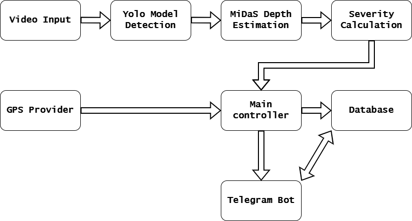
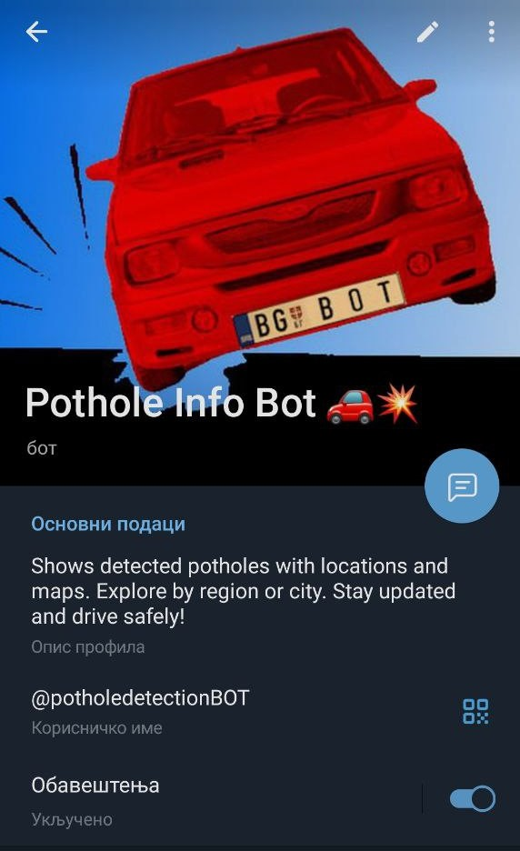

# Pothole Detection System with Telegram Integration

## Overview

The Pothole Detection System is a comprehensive Python application that combines computer vision, GPS tracking, and machine learning to automatically detect and classify potholes on roads. The system uses YOLO for object detection, MiDaS for depth estimation, and provides real-time monitoring capabilities with database storage and Telegram bot integration.


## Features

- **Real-time Pothole Detection**: Uses YOLO v8 for accurate pothole identification  
- **Depth Estimation**: Employs MiDaS model to calculate pothole depth  
- **GPS Integration**: Supports both real GPS devices and simulation mode  
- **Severity Classification**: Automatically categorizes potholes by severity (Low, Medium, High, Critical)  
- **Database Storage**: SQLite database for persistent data storage  
- **Offline Support**: Logs detections offline when database is unavailable  
- **Video Processing**: Supports both live camera feed and video file input  
- **Video Recording**: Optional output video recording with annotations  
- **Telegram Bot Integration**: Remote monitoring and data access via Telegram  
- **Duplicate Detection**: Prevents multiple entries for the same pothole location  

## System Architecture



## Installation

### Prerequisites

- Python 3.8+  
- CUDA-compatible GPU (recommended for faster processing)  
- Webcam or video files for input  
- GPS device (optional, simulation mode available)  

### Required Dependencies

```bash
pip install opencv-python
pip install torch torchvision
pip install ultralytics
pip install geopy
pip install pyserial
pip install numpy
pip install python-telegram-bot
```

## Configuration

The system is configured through the `config.py` file. Key configuration options include:

#### GPS Configuration

```python
USE_SIMULATION = True          # Use simulated GPS data
GPS_PORT = 'COM10'             # Serial port for real GPS
GPS_BAUDRATE = 9600            # GPS baud rate
```

#### Video Configuration

```python
USE_LIVE_CAMERA = False        # True for webcam, False for video file
VIDEO_FILE = 'p.mp4'           # Input video file path
VIDEO_WIDTH = 1020             # Frame width
VIDEO_HEIGHT = 500             # Frame height
FRAME_SKIP = 3                 # Process every nth frame
```

#### Output Configuration

```python
SAVE_VIDEO = True
VIDEO_OUTPUT_PATH = "output/demo_output.avi"
VIDEO_FPS = 20
```

#### Detection Parameters

```python
DUPLICATE_RADIUS_METERS = 5.0  # Duplicate detection radius
```

## Usage

### Basic Usage

1. Configure the system: Edit `config.py` with your desired settings  
2. Run the system:

```bash
python main.py
```

### Input Modes

#### Live Camera Mode

```python
USE_LIVE_CAMERA = True
CAMERA_INDEX = 0  # Default webcam
```

#### Video File Mode

```python
USE_LIVE_CAMERA = False
VIDEO_FILE = 'path/to/your/video.mp4'
```

### GPS Modes

#### Simulation Mode (Default)

```python
USE_SIMULATION = True
```

Uses predefined Belgrade coordinates for testing.

#### Real GPS Mode

```python
USE_SIMULATION = False
GPS_PORT = 'COM10'  # Adjust to your GPS device port
```

## License and Credits


This system integrates several open-source components:

- **YOLO**: Ultralytics YOLO v8  
- **MiDaS**: Intel ISL depth estimation  
- **OpenCV**: Computer vision operations  
- **PyTorch**: Machine learning framework  


### Telegram Bot Commands

- `/start` - Show this help message  
- `/locations` - Browse pothole locations by region  
- `/map` - Get a Google Maps link with all locations  
- `/stats` - View detection statistics  
- `/help`

[](https://t.me/potholedetectionBOT)
