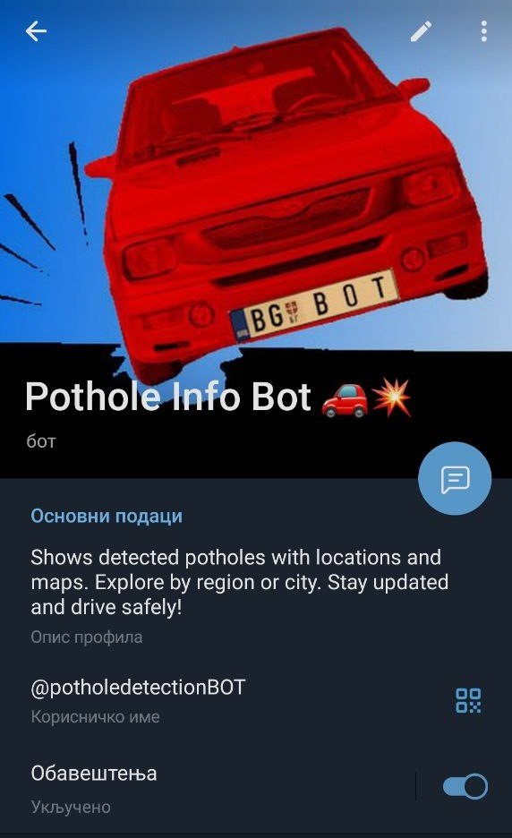
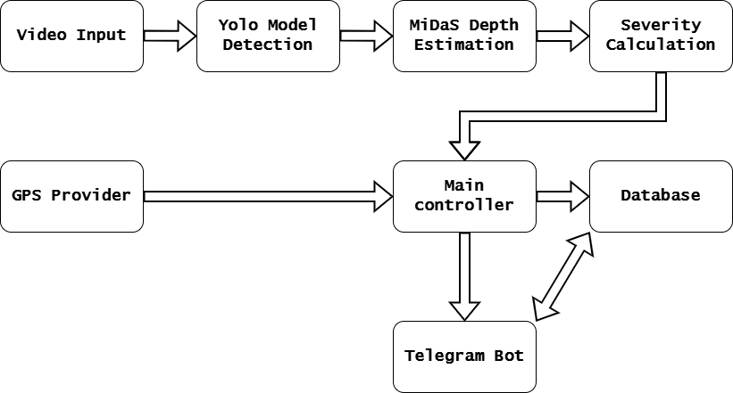
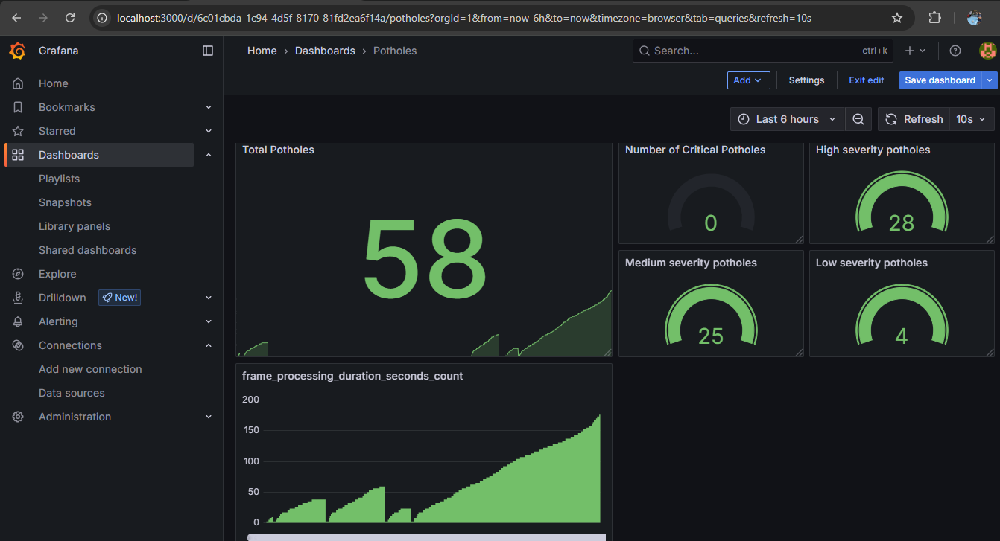

# 🚗 Pothole Detection System

A real-time computer vision system that automatically detects and maps road potholes from a moving vehicle. Mounted camera feeds into a YOLO + MiDaS pipeline that classifies severity, records GPS location, and pushes live alerts to a Telegram bot.


---

## 📱 Try the Telegram Bot

**No installation needed** — just open the bot and start exploring detected potholes:

👉 **[Open Bot on Telegram](https://t.me/potholedetectionBOT)**

---

## Features

- Real-time pothole detection (YOLOv8)
- MiDaS-based depth estimation
- Severity classification (Low / Medium / High / Critical)
- GPS location tagging (real or simulated)
- Duplicate detection prevention
- Detection images saved per pothole
- Offline mode with automatic resync
- Telegram bot with interactive menus and role-based access
- Admin real-time alerts for HIGH and CRITICAL potholes
- Prometheus metrics + Grafana dashboard
- Dockerized with CI/CD via GitHub Actions → Docker Hub

---

## 📱 Telegram Bot

The bot provides a full interactive interface — no commands to memorize, everything is accessible through inline buttons.

| Command | Description |
|---|---|
| `/start` | Main menu with all options |
| `/locations` | Browse potholes by region |
| `/severity` | Filter by severity level |
| `/map` | View all locations on Google Maps |
| `/latest` | Last 5 detected potholes with photos |
| `/stats` | Statistics by severity and region |
| `/status` | System status and user count |
| `/export` | Download all data as CSV |
| `/help` | Help center |



---

## System Architecture



Three parallel threads run simultaneously:

- **Video thread** — reads frames, runs YOLO + MiDaS, writes to database
- **Sync thread** — periodically syncs offline logs to database  
- **Notification thread** — sends Telegram alerts to admin on HIGH/CRITICAL detections

---

## APM & Monitoring

> 

Prometheus metrics exposed on port `8000`:

| Metric | Description |
|---|---|
| `pothole_detections_total` | Total potholes detected |
| `pothole_severity_low_total` | Low severity count |
| `pothole_severity_medium_total` | Medium severity count |
| `pothole_severity_high_total` | High severity count |
| `pothole_severity_critical_total` | Critical severity count |
| `frame_processing_duration_seconds` | Frame processing time |

- Prometheus UI: `http://localhost:9090`
- Grafana Dashboard: `http://localhost:3000`

---

## Built With

- Python 3.11
- OpenCV
- PyTorch + YOLOv8
- MiDaS
- SQLite
- Docker
- Prometheus + Grafana
- Telegram Bot API

---

## CI/CD

GitHub Actions builds and pushes the Docker image to Docker Hub on every commit to `main`.

Docker Hub: [jankokl/detekcija-rupa](https://hub.docker.com/repository/docker/jankokl/detekcija-rupa)

---

## For Developers

<details>
<summary>Click to expand setup instructions</summary>

### Run Locally

```bash
git clone https://github.com/jankokl/DetekcijaRupa.git
cd DetekcijaRupa
pip install -r requirements.txt
```

Create a `.env` file in the project root:

```env
BOT_TOKEN=           # from @BotFather on Telegram
ADMIN_CHAT_ID=       # your chat ID from @userinfobot

USE_LIVE_CAMERA=False
VIDEO_FILE=p.mp4
USE_SIMULATION=True
YOLO_MODEL_PATH=best.pt
```

Run:

```bash
cd app
python main.py
```

### Run with Docker

```bash
docker run -p 8000:8000 --env-file=.env jankokl/detekcija-rupa
```

### Run Full Stack (with Prometheus + Grafana)

```bash
docker compose up -d
```

</details>

---


## Author

**Janko Klikovac**  
GitHub: [@JankoKl](https://github.com/JankoKl)


